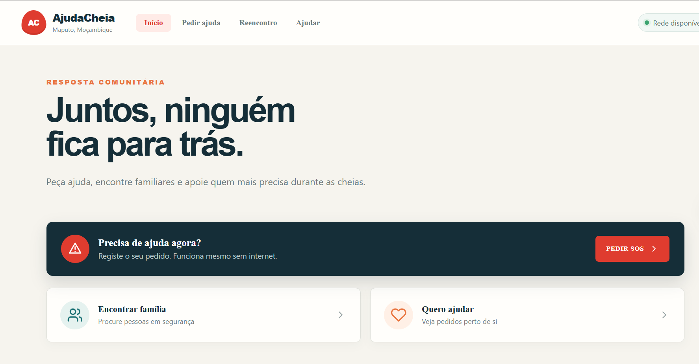
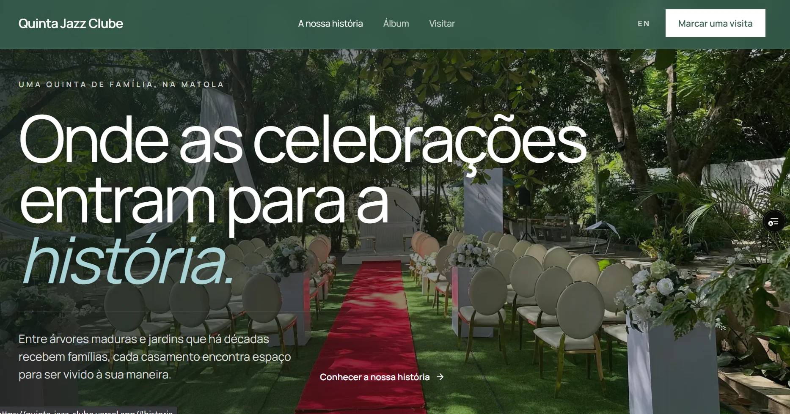

# Hi, I'm Khayllane Nyambir

Full-stack developer from Mozambique who likes understanding how software works beneath the interface—not only what users see, but how data, decisions, and edge cases fit together.

I am looking for an internship, people to build with, and a first opportunity to contribute to open source.

  <picture>
    <source media="(prefers-color-scheme: dark)" srcset="./dark.svg" />
    <source media="(prefers-color-scheme: light)" srcset="./light.svg" />
    
  </picture>

## About Me

I learn best by following a problem until I understand the decisions behind it. That curiosity has taken me from designing interfaces to thinking about authentication, data models, availability, and what should happen when the expected path fails.

The projects below are different in size and purpose, but each began with someone or something real: communities affected by floods, a family business that needed visibility, or a technical question I could not stop thinking about.

## Currently Building

### Salon Booking System

The salon is the setting; scheduling is the problem I wanted to understand.

I started this private project because booking systems raised questions that simple interfaces could not answer: How is availability calculated? What happens when every worker is busy? How should appointments be stored? How do workers authenticate? How are conflicts prevented?

Working through those questions is teaching me backend development, database design, authentication, and scheduling logic. It has also been one of my most mentally demanding projects—and that is exactly why I keep working on it.

**Status:** In progress · Private repository

## Projects with a Purpose

### [AjudaCheia](https://github.com/nyambirkhayllane-svg/ajuda-cheia)

AjudaCheia was our team project for the BIT Hackathon—our first hackathon, and the project that won it.

The challenge was grounded in flooding in Mozambique. People can become isolated without knowing where to find help, while volunteers may not know where help is most urgent. We built AjudaCheia to connect those two sides through SOS requests, volunteer response, and family reunification, including support for limited connectivity.

   
  AjudaCheia home page

`React` · `Vite` · `PWA` · `Offline-first` 
[Repository](https://github.com/nyambirkhayllane-svg/ajuda-cheia) · [Live application](https://ajuda-cheia.vercel.app) · **Completed, with improvements ongoing**

### [Quinta Jazz Clube](https://github.com/nyambirkhayllane-svg/quinta-jazz-clube)

A family member owns Quinta Jazz Clube, an event venue. I built this platform to help the business gain visibility and present the quality of its services online—not as a hypothetical exercise, but as software for a real business.

   
  Quinta Jazz Clube home page

The experience includes an interactive gallery, service presentation, FAQ, responsive navigation, and a clear path for prospective clients to request a quotation.

`Next.js` · `React` · `TypeScript` · `Tailwind CSS` · `Framer Motion` 
[Repository](https://github.com/nyambirkhayllane-svg/quinta-jazz-clube) · **Completed**

### [Personal Portfolio](https://github.com/nyambirkhayllane-svg/My-portfolio)

A simple home for presenting my work, documenting my journey, sharing what I am building, and making my growth visible over time.

`Next.js` · `React` · `TypeScript` · `Tailwind CSS` · `Framer Motion` 
[Repository](https://github.com/nyambirkhayllane-svg/My-portfolio) · **Completed**

### [Terminal Profile Generator](https://github.com/nyambirkhayllane-svg/nyambirkhayllane-svg)

For a long time, GitHub intimidated me. Building this profile—starting with a photograph, turning it into ASCII, and generating responsive SVG themes—was how I began changing that relationship.

The animation is a small detail. The real milestone is that I now maintain my work here and treat GitHub as part of my software engineering journey.

`Python` · `Pillow` · `SVG` · **Completed** 
[Generator documentation](./docs/generator.md)

## Technologies

| Area | Technologies |
| :-- | :-- |
| Frontend | React, Next.js, TypeScript, JavaScript, Tailwind CSS |
| Backend | Node.js |
| Databases | PostgreSQL, MySQL |
| Tools | Python, Git, GitHub, Vite |

### Currently Learning

I am currently strengthening my frontend development skills by building and refining real interfaces.

## GitHub Activity

  
  

## Let's Connect

If you are working on something useful, have an internship opportunity, or welcome first-time open-source contributors, I would be glad to hear from you.

  
  
  

